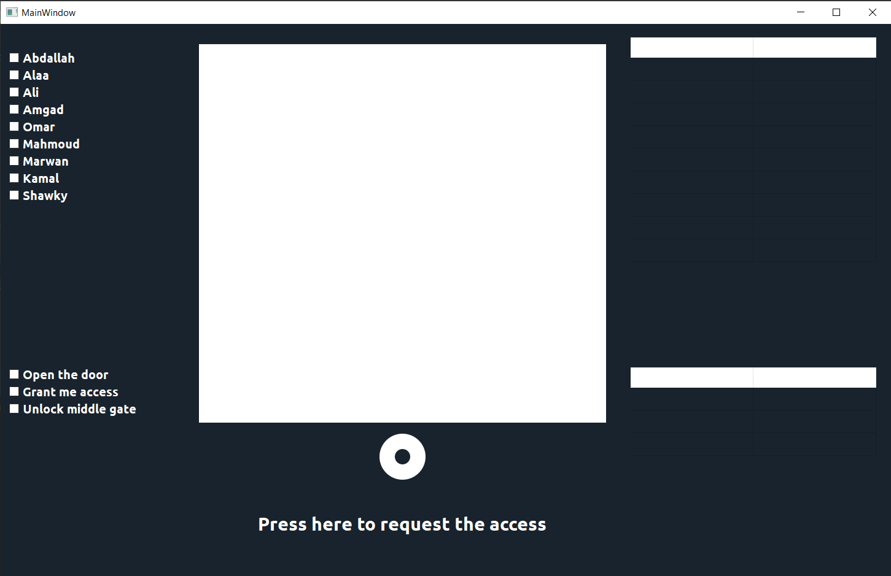

# Voice-Based Access Control

## Description

This application provides a graphical interface for voice-based security access. It allows users to record sound, analyze spectrograms, and verify access based on pre-trained models. The GUI is built using PyQt5, with plotting capabilities provided by PyQtGraph and Matplotlib.

## Table of Contents

1. [Description](#description)
2. [Installation](#installation)
3. [Features](#features)
4. [Dependencies](#dependencies)
5. [Usage](#usage)
    - [Recording Sound](#recording-sound)
    - [Analyzing Spectrogram](#analyzing-spectrogram)
    - [Predicting Access](#predicting-access)
6. [Plot Descriptions](#plot-descriptions)
7. [UI Elements](#ui-elements)
8. [Developer Notes](#developer-notes)
9. [Acknowledgments](#acknowledgments)
10. [Contributors](#contributors)

## Installation

1.Clone the repository:

```bash
# Clone the repository
git clone https://github.com/omarshaban02/Security-Voice-code-Access

# Navigate to the project directory
cd Security-Voice-code-Access
```

2.Install the required dependencies:

```bash
# Install the requirements
pip install -r requirements.txt
```

## Features

- Record sound through the application
- Visualize spectrograms of recorded sounds
- Predict access based on voice models
- Display prediction statistics for persons and words

## Dependencies

- PyQt5
- PyQtGraph
- Matplotlib
- NumPy
- Pandas

## Usage



### Recording Sound

1. Click the `Record` button to start recording sound.
2. The application will process the sound and display the spectrogram.

 


### Analyzing Spectrogram

1. The spectrogram of the recorded sound is plotted automatically.
2. Use the spectrogram plot to analyze the frequency and time characteristics of the sound.

### Predicting Access

1. The application uses pre-trained models to predict if the person and word match the authorized ones.
2. The result is displayed as "The Door is opened" or "The Door is closed" based on the prediction.

 


## Plot Descriptions

- **Spectrogram Plot**: Displays the spectrogram of the recorded sound, showing the intensity of frequencies over time.

## UI Elements

- **Plot Widgets**: Main plot area for spectrogram visualization.
- **Buttons**:
  - `Record`: Starts recording sound.
- **List Widgets**:
  - `Persons List`: Displays the list of possible persons.
  - `Words List`: Displays the list of possible words.
- **Tables**:
  - `Persons Stats`: Shows the prediction percentages for each person.
  - `Words Stats`: Shows the prediction percentages for each word.

## Developer Notes

- Ensure that the `Sound` and `Model` classes from `Security_Voice_code_Access` are properly implemented and available in the project directory.
- The application uses `QPropertyAnimation` for smooth sidebar transitions.
- Validators are set for input fields to ensure proper data types are entered.

## Acknowledgments

- PyQt5 for the GUI framework.
- PyQtGraph and Matplotlib for the plotting capabilities.
- Contributors and community for support and libraries.

## Contributors <a name = "contributors"></a>

<table>
  <tr>
    <td align="center">
    <a href="https://github.com/AbdulrahmanGhitani" target="_black">
    
    <br />
    <sub><b>Abdulrahman Shawky</b></sub></a>
    </td>
<td align="center">
    <a href="https://github.com/omarnasser0" target="_black">
    
    <br />
    <sub><b>Omar Abdulnasser</b></sub></a>
    </td>
         <td align="center">
    <a href="https://github.com/AhmedKamalMohammedElSayed" target="_black">
    
    <br />
    <sub><b>Ahmed Kamal</b></sub></a>
    </td>
         <td align="center">
    <a href="https://github.com/AbdullahOmran" target="_black">
    
    <br />
    <sub><b>Abdullah Omran</b></sub></a>
    </td>
      </tr>
 </table>
